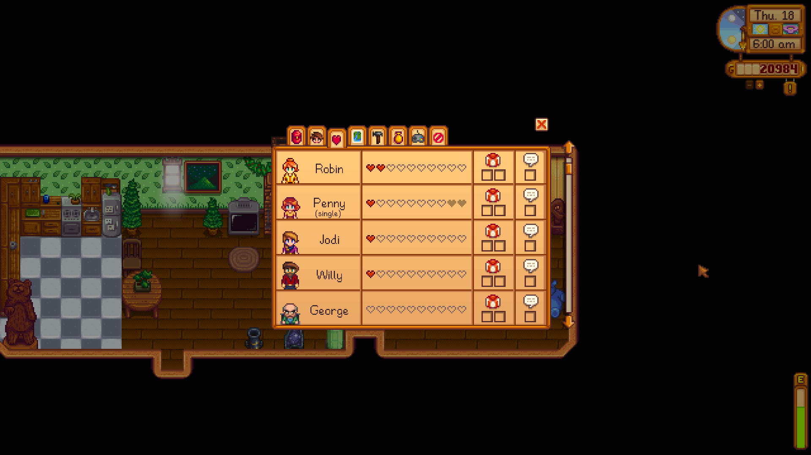

# Social Page

<table>
    <tr>
        <th>Command</th>
        <th>Description</th>
        <th>Example</th>
    </tr>
    <tr>
        <td>&lt;charcter&gt;</td>
        <td>Launch a character's <a href="./gift-log.md">gift log</a> if he/she is onscreen.</td>
        <td>"george"</td>
    </tr>
        <tr>
        <td>scroll (up  &#124; down)</td>
        <td>Scroll up or down in the list of characters.</td>
        <td>"scroll up"</td>
    </tr>
    <tr>
        <td>page (up  &#124; down)</td>
        <td>Scroll an entire page up or down in the list of characters.</td>
        <td>"page down"</td>
    </tr>
</table>