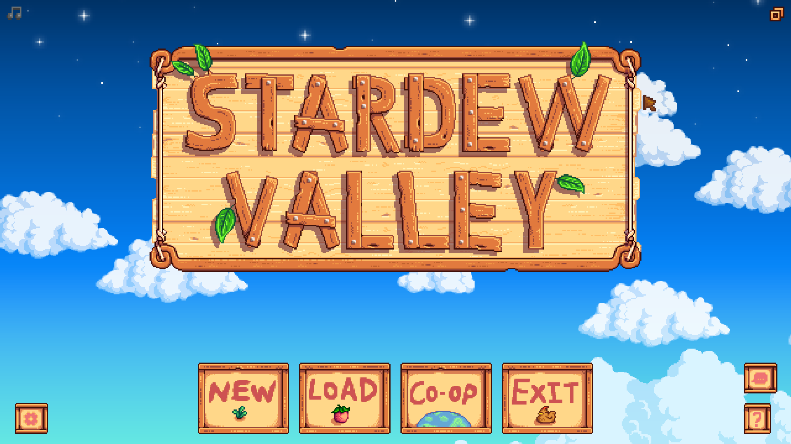

# Title Menu

<table>
    <tr>
        <th>Command</th>
        <th>Description</th>
        <th>Example</th>
    </tr>
    <tr>
        <td>new [game]</td>
        <td>Click the new game button.</td>
        <td>"new game"</td>
    </tr>
    <tr>
        <td>load [game]</td>
        <td>Click the load game button.</td>
        <td>"load game"</td>
    </tr>
    <tr>
        <td>co-op [game]</td>
        <td>Click the co-op game button.</td>
        <td>"co-op game"</td>
    </tr>
    <tr>
        <td>exit [game]</td>
        <td>Click the exit game button.</td>
        <td>"exit game"</td>
    </tr>
    <tr>
        <td>[change | select] (language | languages)</td>
        <td>Open the select language menu.</td>
        <td>"change language"</td>
    </tr>
</table>